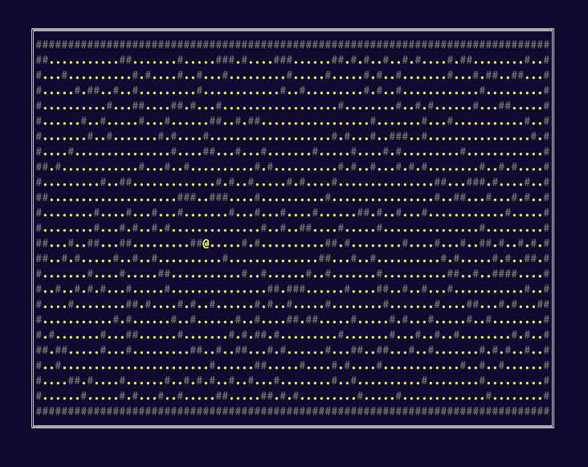

# rogue-cross

Implementing some chapters of the [Roguelike Tutorial - In Rust](https://bfnightly.bracketproductions.com/)
using [crossterm](https://github.com/crossterm-rs/crossterm) to run them directly in the terminal

Find the source code of the original implementation using rltk
[here](https://github.com/thebracket/rustrogueliketutorial).

](./assets/ch03.gif)

## FAQ

> Why not use rltk _aka_ bracket-lib using the crossterm backend?

I tried that but it didn't work out so well as in the bracket-lib crate failed to compile with
it enabled. Then I found [this redit
comment](https://www.reddit.com/r/rust/comments/heh68q/rltkbracketlib_100_usage/fwaaehp?utm_source=share&utm_medium=web2x&context=3)
by the bracket-lib author. 

_> the curses and crossterm back-ends are pretty poor. I honestly regret putting them in there_

Also I like to be a little more low level and implement things like the game loop myself
instead of using an engine that hides those details. At least while I'm trying to learn about
things.

## License

MIT
